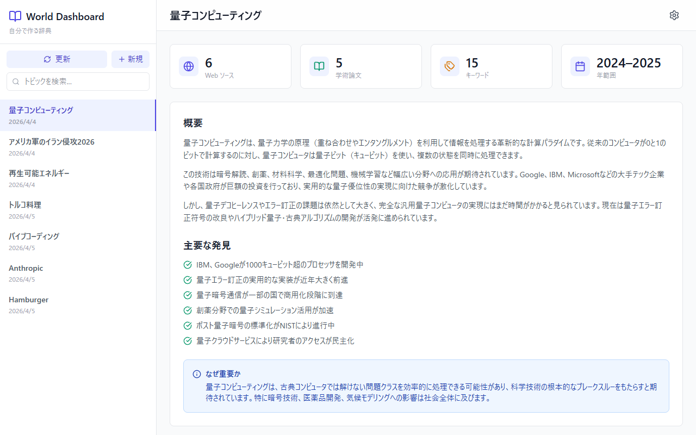
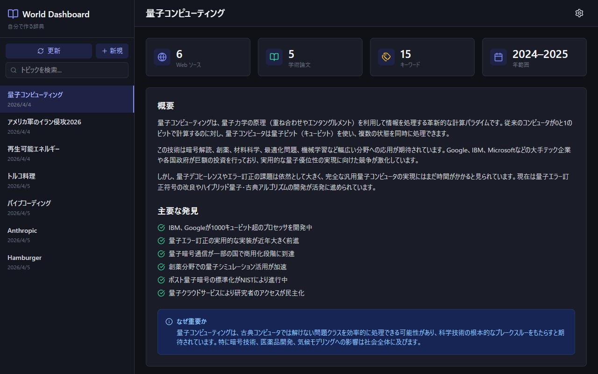
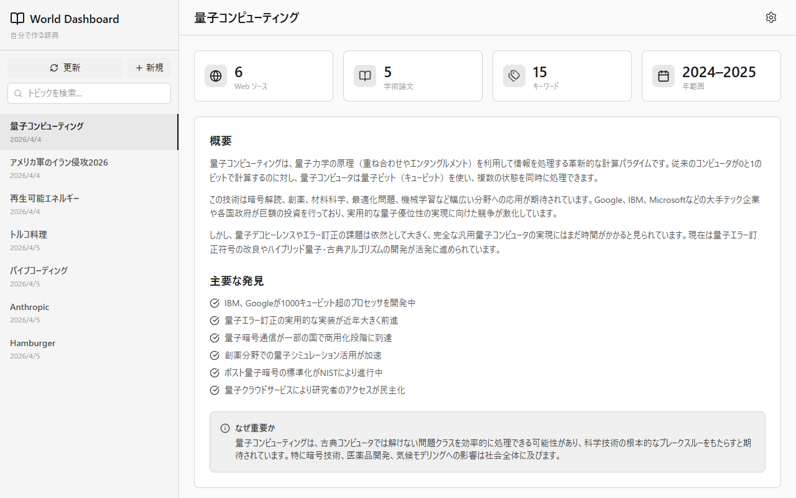
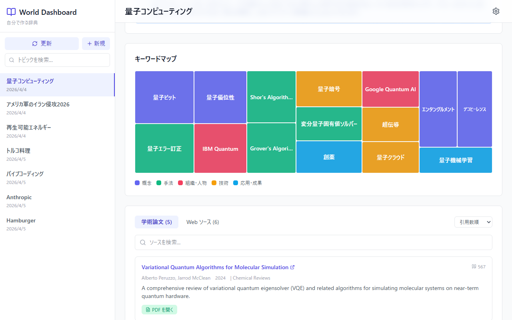
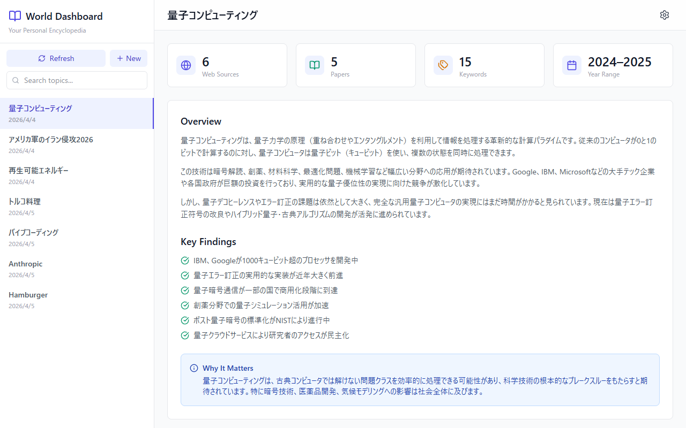

# World Dashboard

**Your Personal Encyclopedia** — An AI-powered research dashboard that investigates any topic using web search and academic papers, then displays the results in an interactive dashboard.

[日本語](./docs/README.ja.md) | [中文](./docs/README.zh.md) | [Español](./docs/README.es.md) | [Italiano](./docs/README.it.md) | [Français](./docs/README.fr.md)

## Screenshots

### Light Theme


### Dark Theme


### Monochrome Theme


### Keyword Map & Sources


### English UI


## Features

- **AI Research Agent** — Claude Code automatically searches the web and academic databases (Semantic Scholar) for any topic
- **Interactive Dashboard** — Overview, keyword treemap, source list with tabs
- **Ochiai-style Paper Summaries** — Structured 6-point summary for each paper (What / Novelty / Method / Validation / Discussion / Next)
- **Papers First** — Academic papers tab default, sorted by citation count
- **Multi-language** — UI and generated content in English, Japanese, Chinese, Spanish, Italian, French
- **Theme Switching** — Light, Dark, and Monochrome themes
- **Persistent Settings** — Preferences saved to localStorage
- **Growing Knowledge Base** — Topics saved locally and revisitable anytime

## Tech Stack

| Layer | Technology |
|-------|-----------|
| Frontend | React 18 + TypeScript + Vite 6 |
| Styling | Tailwind CSS 4 |
| Charts | Recharts |
| Icons | Lucide React |
| AI Agent | Claude Code CLI |
| Papers | Semantic Scholar API (free) |
| Data | Local JSON files |

## Prerequisites

- [Node.js](https://nodejs.org/) 18+
- [Claude Code CLI](https://www.npmjs.com/package/@anthropic-ai/claude-code) (`npm install -g @anthropic-ai/claude-code`)
- Claude Code subscription

## Setup

```bash
git clone git@github.com:onsoku/WorldDashboard.git
cd WorldDashboard
npm install
claude auth login   # first time only
npm run dev
```

Open http://localhost:5173

## Usage

1. Click **"+ New"** in the sidebar
2. Enter a research topic
3. Click **"Start Research"** — progress shown in real-time
4. Dashboard displays results when complete
5. Switch between past topics in the sidebar
6. Change theme/language via the ⚙️ icon

## Project Structure

```
WorldDashboard/
├── .claude/skills/research/   # AI research skill definition
├── server/research-api.ts     # Backend API (Vite middleware)
├── public/data/               # Generated research data (JSON)
├── src/
│   ├── components/            # React UI components
│   ├── context/               # Settings context (theme + language)
│   ├── hooks/                 # Data loading hooks
│   ├── i18n/                  # Translations (6 languages)
│   └── types/                 # TypeScript interfaces
└── docs/                      # Translated READMEs
```

## License

MIT
